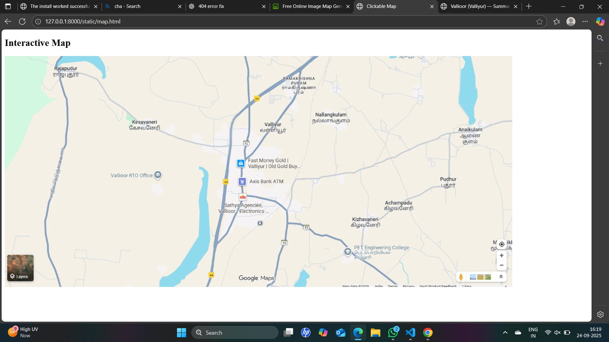

# Ex04 Places Around Me
## Date: 24/09/2025

## AIM
To develop a website to display details about the places around my house.

## DESIGN STEPS

### STEP 1
Create a Django admin interface.

### STEP 2
Download your city map from Google.

### STEP 3
Using ```<map>``` tag name the map.

### STEP 4
Create clickable regions in the image using ```<area>``` tag.

### STEP 5
Write HTML programs for all the regions identified.

### STEP 6
Execute the programs and publish them.

## CODE
```
kesavaneri.html
<!DOCTYPE html>
<html lang="en">
<head>
  <meta charset="utf-8">
  <meta name="viewport" content="width=device-width, initial-scale=1">
  <title>Kesavaneri — Place Summary</title>
  <style>
    :root {
      --accent: #3b7dd8;
      --bg: #f0f4f9;
      --card: #ffffff;
    }
    body {
      margin: 0;
      font-family: Arial, sans-serif;
      background-color: var(--bg);
      color: #222;
    }
    .container {
      max-width: 800px;
      margin: 24px auto;
      padding: 16px;
    }
    header {
      display: flex;
      align-items: center;
      gap: 12px;
    }
    .badge {
      background-color: var(--accent);
      color: white;
      padding: 6px 12px;
      border-radius: 6px;
      font-weight: bold;
    }
    h1 {
      margin: 0;
      font-size: 1.6rem;
    }
    .meta {
      margin-top: 6px;
      color: #555;
      font-size: 0.95rem;
    }
    .card {
      background-color: var(--card);
      border-radius: 10px;
      box-shadow: 0 4px 12px rgba(0,0,0,0.06);
      padding: 20px;
      margin-top: 20px;
    }
    img.hero {
      width: 100%;
      height: 220px;
      object-fit: cover;
      border-radius: 8px;
      margin-bottom: 16px;
    }
    dl {
      display: grid;
      grid-template-columns: 140px 1fr;
      gap: 8px 16px;
      margin: 16px 0;
    }
    dt {
      font-weight: 600;
      color: #333;
    }
    dd {
      margin: 0;
      color: #555;
    }
    footer {
      margin-top: 20px;
      font-size: 0.85rem;
      color: #666;
    }
  </style>
</head>
<body>
  <div class="container">
    <header>
      <div class="badge">Kesavaneri</div>
      <div>
        <h1>Kesavaneri (கேசவநெறி)</h1>
        <div class="meta">Small village / hamlet in Kanniyakumari / Tirunelveli border region, Tamil Nadu</div>
      </div>
    </header>

    <article class="card">
      <!-- Replace src with actual image if available -->

      <p>
        Kesavaneri (also spelled Keasavaneri) is a small village/hamlet in the Thovala Block of Kanniyakumari District, Tamil Nadu. :contentReference[oaicite:0]{index=0}  
        It falls under the Thidal Panchayat. :contentReference[oaicite:1]{index=1}  
        The area is near the Kanniyakumari–Tirunelveli district border, making it part of a region with mixed administrative influence. :contentReference[oaicite:2]{index=2}
      </p>

      <dl>
        <dt>State</dt><dd>Tamil Nadu, India</dd>
        <dt>District</dt><dd>Kanniyakumari :contentReference[oaicite:3]{index=3}</dd>
        <dt>Block / Taluk</dt><dd>Thovala Block :contentReference[oaicite:4]{index=4}</dd>
        <dt>Panchayat</dt><dd>Thidal Panchayat :contentReference[oaicite:5]{index=5}</dd>
        <dt>Elevation</dt><dd>~ 62 meters above sea level :contentReference[oaicite:6]{index=6}</dd>
        <dt>PIN (Post)</dt><dd>627117 (Vallioor Post Office) :contentReference[oaicite:7]{index=7}</dd>
        <dt>Telephone / Std Code</dt><dd>04652 :contentReference[oaicite:8]{index=8}</dd>
        <dt>Official Languages</dt><dd>Tamil & English :contentReference[oaicite:9]{index=9}</dd>
        <dt>Nearby Cities / Towns</dt><dd>Valliyoor, Nagercoil, Panagudi :contentReference[oaicite:10]{index=10}</dd>
      </dl>

      <h2>Significance & Features</h2>
      <p>
        Kesavaneri is primarily a rural locality, with its community life shaped by nearby towns like Vallioor and proximity to transport & markets in the region. :contentReference[oaicite:11]{index=11}  
        The village is reachable by local roads; nearest railway access is via Valliyur Railway Station. :contentReference[oaicite:12]{index=12}  
        The political representation comes under Radhapuram Assembly Constituency and Tirunelveli Parliamentary Constituency. :contentReference[oaicite:13]{index=13}
      </p>

      <footer>
        Data sources: OneFiveNine (village directory), MapCarta, public records.  
        If you want, I can get the latest census population number, or embed a map view and nearby landmarks.
      </footer>
    </article>
  </div>
</body>
</html>
 
 nallangkulam.html
 <!DOCTYPE html>
<html lang="en">
<head>
  <meta charset="utf-8">
  <meta name="viewport" content="width=device-width, initial-scale=1">
  <title>Nallangulam — Place Summary</title>
  <style>
    :root {
      --accent: #2a75bb;
      --bg: #f0f4f8;
      --card: #ffffff;
    }
    body {
      margin: 0;
      font-family: Arial, sans-serif;
      background-color: var(--bg);
      color: #222;
    }
    .container {
      max-width: 800px;
      margin: 24px auto;
      padding: 16px;
    }
    header {
      display: flex;
      align-items: center;
      gap: 12px;
    }
    .badge {
      background-color: var(--accent);
      color: white;
      padding: 6px 12px;
      border-radius: 6px;
      font-weight: bold;
    }
    h1 {
      margin: 0;
      font-size: 1.6rem;
    }
    .meta {
      margin-top: 6px;
      color: #555;
      font-size: 0.95rem;
    }
    .card {
      background-color: var(--card);
      border-radius: 10px;
      box-shadow: 0 4px 12px rgba(0,0,0,0.06);
      padding: 20px;
      margin-top: 20px;
    }
    img.hero {
      width: 100%;
      height: 220px;
      object-fit: cover;
      border-radius: 8px;
      margin-bottom: 16px;
    }
    dl {
      display: grid;
      grid-template-columns: 140px 1fr;
      gap: 8px 16px;
      margin: 16px 0;
    }
    dt {
      font-weight: 600;
      color: #333;
    }
    dd {
      margin: 0;
      color: #555;
    }
    footer {
      margin-top: 20px;
      font-size: 0.85rem;
      color: #666;
    }
  </style>
</head>
<body>
  <div class="container">
    <header>
      <div class="badge">Nallangulam</div>
      <div>
        <h1>Nallangulam, Virudhunagar District</h1>
        <div class="meta">Village in Tiruchuli block, Virudhunagar district, Tamil Nadu</div>
      </div>
    </header>

    <article class="card">
    
      <p>
        Nallangulam (also spelled “நல்லான்குளம்”) is a village in the Tiruchuli block of Virudhunagar district, Tamil Nadu, India. :contentReference[oaicite:0]{index=0}
        It is part of the Nallangulam Panchayat. :contentReference[oaicite:1]{index=1}
      </p>

      <dl>
        <dt>State</dt><dd>Tamil Nadu, India</dd>
        <dt>District</dt><dd>Virudhunagar :contentReference[oaicite:2]{index=2}</dd>
        <dt>Block / Taluk</dt><dd>Tiruchuli block :contentReference[oaicite:3]{index=3}</dd>
        <dt>Elevation</dt><dd>≈ 67 meters above sea level :contentReference[oaicite:4]{index=4}</dd>
        <dt>Pincode(s)</dt><dd>626114 (nearby area) :contentReference[oaicite:5]{index=5}</dd>
        <dt>Languages</dt><dd>Tamil (primary), also Urdu & English in some contexts :contentReference[oaicite:6]{index=6}</dd>
        <dt>Assembly Constituency</dt><dd>Tiruchuli :contentReference[oaicite:7]{index=7}</dd>
        <dt>Nearby Towns / Cities</dt><dd>Thiruchuli (~15 km), Virudhunagar (~54 km), cities like Aruppukkottai, Paramakudi also nearby :contentReference[oaicite:8]{index=8}</dd>
      </dl>

      <h2>Features & Infrastructure</h2>
      <p>
        Agriculture is a primary occupation in Nallangulam. :contentReference[oaicite:9]{index=9}  
        There is a Govt. High School (classes 6-10) in the region under local rural block management. :contentReference[oaicite:10]{index=10}  
        Basic problems reported by local sources include need for better roads, drinking water supply, medical/health services, and electricity stability. :contentReference[oaicite:11]{index=11}
      </p>

      <h2>Transport & Connectivity</h2>
      <p>
        Nallangulam is connected by road. Nearest major towns are reachable via local roads. Public transport (buses) serve nearby villages. :contentReference[oaicite:12]{index=12}  
        Nearest railway stations are more than 10 km away. :contentReference[oaicite:13]{index=13}
      </p>

      <footer>
        Summary compiled from public sources. If you want, I can fetch census numbers (population etc.) or embed a local map.
      </footer>
    </article>
  </div>
</body>
</html>

vallioor.html

```
<!DOCTYPE html>
<html lang="en">
<head>
  <meta charset="utf-8" />
  <meta name="viewport" content="width=device-width, initial-scale=1" />
  <title>Vallioor (Valliyur) — Summary</title>
  <style>
    :root {
      --accent: #0c5fa5;
      --bg: #f4f7fa;
      --card: #ffffff;
    }
    body {
      margin: 0;
      font-family: Arial, sans-serif;
      background-color: var(--bg);
      color: #222;
    }
    .container {
      max-width: 800px;
      margin: 24px auto;
      padding: 16px;
    }
    header {
      display: flex;
      align-items: center;
      gap: 12px;
    }
    .badge {
      background-color: var(--accent);
      color: white;
      padding: 6px 12px;
      border-radius: 6px;
      font-weight: bold;
    }
    h1 {
      margin: 0;
      font-size: 1.6rem;
    }
    .meta {
      margin-top: 6px;
      color: #555;
      font-size: 0.95rem;
    }
    .card {
      background-color: var(--card);
      border-radius: 10px;
      box-shadow: 0 4px 12px rgba(0,0,0,0.06);
      padding: 20px;
      margin-top: 20px;
    }
    img.hero {
      width: 100%;
      height: 220px;
      object-fit: cover;
      border-radius: 8px;
      margin-bottom: 16px;
    }
    dl {
      display: grid;
      grid-template-columns: 140px 1fr;
      gap: 8px 16px;
      margin: 16px 0;
    }
    dt {
      font-weight: 600;
      color: #333;
    }
    dd {
      margin: 0;
      color: #555;
    }
    footer {
      margin-top: 20px;
      font-size: 0.85rem;
      color: #666;
    }
  </style>
</head>
<body>
  <div class="container">
    <header>
      <div class="badge">Vallioor</div>
      <div>
        <h1>Vallioor (Valliyur)</h1>
        <div class="meta">Town Panchayat in Tirunelveli district, Tamil Nadu</div>
      </div>
    </header>

    <article class="card">

      <p>
        Vallioor (also spelled **Valliyur** or **Vadakku Vallioor**) is a town panchayat in the Radhapuram taluk
        of Tirunelveli district, in the Indian state of Tamil Nadu. :contentReference[oaicite:1]{index=1}
        It lies along the historic NH-7 (now part of NH-44), connecting Tirunelveli to Nagercoil / Kanyakumari. :contentReference[oaicite:2]{index=2}
      </p>

      <dl>
        <dt>State</dt><dd>Tamil Nadu, India</dd>
        <dt>District</dt><dd>Tirunelveli</dd>
        <dt>Taluk</dt><dd>Radhapuram</dd>
        <dt>Elevation</dt><dd>~ 121 m :contentReference[oaicite:3]{index=3}</dd>
        <dt>Population (2011)</dt><dd>29,417 :contentReference[oaicite:4]{index=4}</dd>
        <dt>Estimated Population (2024)</dt><dd>≈ 41,000 :contentReference[oaicite:5]{index=5}</dd>
        <dt>Official Language</dt><dd>Tamil</dd>
        <dt>Pincode</dt><dd>627117 :contentReference[oaicite:6]{index=6}</dd>
        <dt>Telephone Code</dt><dd>04637 :contentReference[oaicite:7]{index=7}</dd>
        <dt>Vehicle Registration</dt><dd>TN-72 :contentReference[oaicite:8]{index=8}</dd>
      </dl>

      <h2>Notable Features & Landmarks</h2>
      <p>
        One of the key attractions is the ancient **Vallioor Subramanya Swamy Temple**, a cave-temple
        carved into a hillock, dedicated to Lord Murugan (Subramanya) along with consort Valli. :contentReference[oaicite:9]{index=9}
        The temple is revered in the canonical hymns *Thiruppukazh* by Arunagirinathar. :contentReference[oaicite:10]{index=10}
      </p>
      <p>
        The temple features a rock-cut sanctum, mandapams, and adjacent **Saravanapoikai** tank. :contentReference[oaicite:11]{index=11}
        Legends say that Murugan created the tank by striking the earth with his spear, at Valli’s request. :contentReference[oaicite:12]{index=12}
      </p>

      <h2>Demographics & Society</h2>
      <p>
        As of the 2011 census, Vallioor’s literacy rate is quite high — around **91.09 %**, with male literacy ~ 94.8 % and female literacy ~ 87.5 %. :contentReference[oaicite:13]{index=13}  
        The religious composition includes Hindus (≈ 77 %), Christians (≈ 21 %), and Muslims (≈ 1.6 %). :contentReference[oaicite:14]{index=14}
      </p>

      <h2>Transport & Connectivity</h2>
      <p>
        Vallioor is well connected by both road and rail. :contentReference[oaicite:15]{index=15}  
        It lies on the **NH-44** (former NH-7), providing north–south highway connectivity. :contentReference[oaicite:16]{index=16}  
        The **Vallioor Railway Station** links to several major cities including Chennai, Bengaluru, Mumbai, Delhi, etc. :contentReference[oaicite:17]{index=17}  
        Major airports nearby include Thoothukkudi (~ 75 km), Thiruvananthapuram (~ 120 km), and Madurai (~ 200 km). :contentReference[oaicite:18]{index=18}
      </p>

      <h2>History & Legend</h2>
      <p>
        Vallioor derives its name from **Valli + Oor** (Valli’s village), where Valli is the consort of Lord Murugan. :contentReference[oaicite:19]{index=19}  
        According to legends, the temple was discovered by a Pandya king on a hunting expedition and later expanded by his descendants. :contentReference[oaicite:20]{index=20}  
        In the 13th century, the area was under the rule of Kulasekhara Pandyan, who is said to have fortified the town. :contentReference[oaicite:21]{index=21}  
        The Mahendragiri hills to the west also have mythological importance, being associated with the penance of sages like Parasurama. :contentReference[oaicite:22]{index=22}  
      </p>

      <footer>
        Compiled using public sources: Wikipedia, Murugan temple site, local histories.  
        (If you like, I can add an interactive map embed or more photos.)
      </footer>
    </article>
  </div>
</body>
</html>

## OUTPUT


.png>)

.png>)

.png>)
## RESULT
The program for implementing image maps using HTML is executed successfully.
